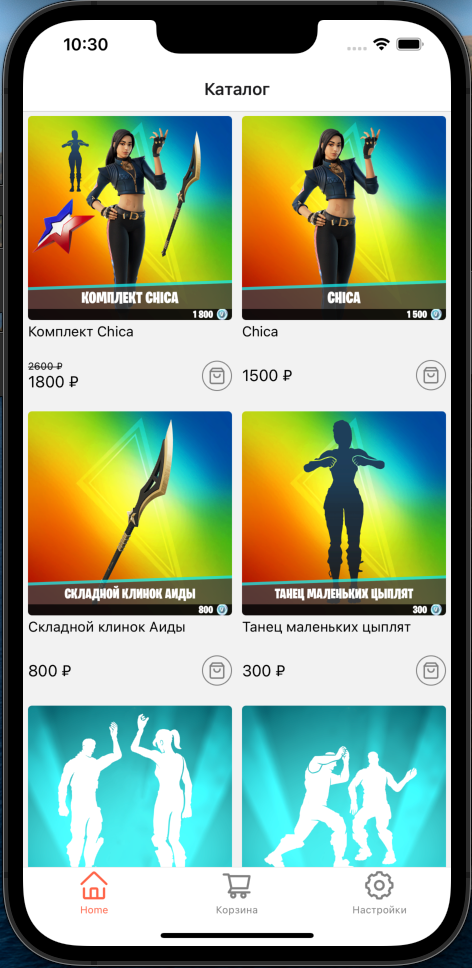

# Задание на стажировку "React Native"  в Lad

Приложение использует api https://fortniteapi.io/

## Использованые библиотеки:
   * @gorhom/bottom-sheet
   * react-navigation
   * @shopify/flash-list
   * react-query
   * axios
   * react-native-toast-notifications
    

## Скриншоты

  

  

  

  

  

